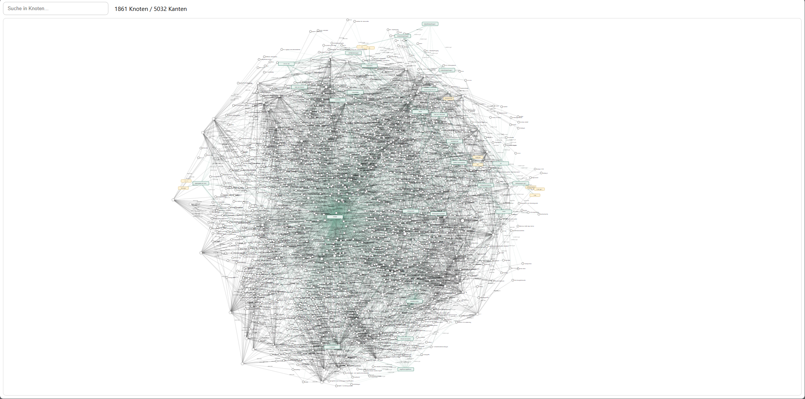
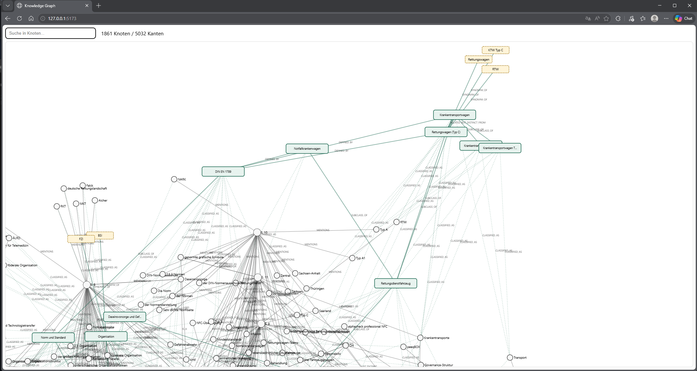

# Basic Knowledge Graph

Dieses Repository enthaelt zwei Varianten eines lokalen Wissensgraphen. Beide lesen Exzerpte aus Markdown-Tabellen oder PDFs, erzeugen daraus `graph.json` und zeigen den Graphen anschliessend in einer Svelte/D3-Weboberflaeche an.

Die Grundidee ist einfach: Ein Exzerpt wird nicht nur als Text angezeigt, sondern in Dokumente, Textstellen, erkannte Begriffe und Beziehungen zerlegt. Dadurch kann man im Browser sehen, welche Aussagen aus welcher Quelle stammen, welche Begriffe wiederkehren und wie sie miteinander verbunden sind.

## Inhaltsverzeichnis

- [Versionen](#versionen)
- [Quickstart im Browser](#quickstart-im-browser)
- [Eigene Exzerpte](#eigene-exzerpte)
- [Wie der Graph grundsaetzlich funktioniert](#wie-der-graph-grundsaetzlich-funktioniert)
- [Bedienung](#bedienung)
- [Weiterfuehrende Dokumentation](#weiterfuehrende-dokumentation)

## Versionen

### withoutBoxing

`withoutBoxing` ist die reduzierte Grundversion. Sie baut aus den Eingaben einen nachvollziehbaren Wissensgraphen mit Dokument-, Exzerpt-, Entitaets- und Relationsknoten. Diese Variante eignet sich, wenn man vor allem sehen will, welche Aussagen und Begriffe direkt aus den Exzerpten extrahiert wurden.

Technische Dokumentation: [withoutBoxing/README.md](withoutBoxing/README.md)


Start:

```bat
cd withoutBoxing
quickstart.bat
```

### withBoxing

`withBoxing` erweitert die Grundversion um eine sichtbare begriffliche Ordnung. Die extrahierten Textdaten bleiben als ABox erhalten: konkrete Dokumente, Exzerpte, Entitaeten und aus dem Text gewonnene Relationen. Zusaetzlich fuegt die Variante eine TBox hinzu: gruen dargestellte Klassen wie `Rettungsdienst`, `Rettungsdienstfahrzeug`, `DIN EN 1789`, `IT-Sicherheit`, `Schwachstelle`, `Schnittstelle`, `Drahtlose Kommunikation`, `Medizinprodukt` oder `Vernetztes System`.

Diese Boxen sind fuer RAG-Szenarien nuetzlich, weil ein Retrieval-System nicht nur einzelne Textstellen finden kann, sondern die Treffer auch fachlich einordnen kann. Beispiel: Ein Exzerpt zur BSI-Orientierungsstudie nennt `DIN EN 1789`, `Typ A1`, `Typ A2`, `Typ B` oder `Typ C`. Die konkrete Nennung bleibt in der ABox, wird aber automatisch mit den passenden TBox-Klassen verbunden. So wird sichtbar, dass `Krankentransportwagen Typ A1` und `Krankentransportwagen Typ A2` Unterklassen von `Krankentransportwagen` sind, waehrend `Rettungswagen (Typ C)` normativ ein eigener Fahrzeugtyp ist und trotzdem ueber einen Hinweis als fachlich verwandte, aber nicht identische Klasse markiert wird.

Technische Dokumentation: [withBoxing/README.md](withBoxing/README.md)






Start:

```bat
cd withBoxing
quickstart.bat
```

## Quickstart im Browser

Voraussetzungen:

- Windows
- Python 3.10 oder neuer
- Node.js mit npm

Der Quickstart wird aus dem Ordner der gewuenschten Version gestartet. Er erstellt bei Bedarf eine virtuelle Python-Umgebung, installiert die Python-Abhaengigkeiten, baut `graph.json`, kopiert sie nach `svelte-app/public/graph.json`, installiert die Node-Abhaengigkeiten und startet danach die Svelte-App mit Vite.

Nach dem Start oeffnet sich der Browser automatisch. Falls nicht, zeigt Vite im Terminal die lokale Adresse an, normalerweise:

```text
http://127.0.0.1:5173/
```

Der Wissensgraph laeuft dann als lokale Webanwendung im Browser. Der Vite-Server bleibt im Terminal aktiv; zum Beenden `Strg+C` druecken.

## Eigene Exzerpte

Beim Start fragt `quickstart.bat`, ob das Standardbeispiel oder eigene Exzerpte verwendet werden sollen. Bei eigenen Exzerpten oeffnet sich ein Dateidialog. Dort koennen eine oder mehrere Markdown- oder PDF-Dateien ausgewaehlt werden. Danach fragt das Skript, ob weitere Dateien hinzugefuegt werden sollen. Erst wenn diese Frage nicht mit `j` beantwortet wird, baut das Skript den Graphen und startet die Browseransicht.

Markdown-Exzerpte sollten diese Tabellenstruktur verwenden:

```markdown
| Seite | Inhalt | Anmerkung |
|-------|--------|-----------|
| 12 | Die Quelle beschreibt die Neuordnung lokaler Herrschaft. | Begriff "Herrschaft" pruefen. |
| 13 | Der Stadtrat ist Teil der lokalen Verwaltung. | Beleg fuer institutionelle Beziehung. |
```

Optional koennen vor der Tabelle Metadaten stehen:

```markdown
- **Haupttitel:** Beispielquelle
- **Autor:** Muster, Maria
- **Jahr:** 1848
```

## Wie der Graph grundsaetzlich funktioniert

Jede Eingabedatei wird zuerst als `Document` erfasst. Jede Tabellenzeile oder PDF-Seite wird ein `Excerpt`. Aus `Inhalt` und `Anmerkung` werden Entitaeten und Begriffe erkannt, zum Beispiel Organisationen, Orte, Produktnamen, Normen oder fachliche Konzepte. Zwischen Exzerpten und Begriffen entstehen `MENTIONS`-Kanten. Wenn ein Satz einfache Muster wie "ist", "umfasst", "nutzt" oder "ist Teil von" enthaelt, werden daraus zusaetzliche Relationskanten wie `IS_A`, `HAS_PART`, `USES` oder `PART_OF`.

In `withBoxing` kommt danach die Box-Schicht hinzu. Die Stichwoerter fuer diese Boxen sind im Code als `aliases` und `keywords` hinterlegt, aber sie wirken erst auf Grundlage des konkreten Eingabe-Exzerpts. Wenn die BSI-Orientierungsstudie also haeufig `Rettungsdienst`, `DIN EN 1789`, `Bluetooth`, `WLAN`, `Beatmungsgeraet`, `RTW` oder `KTW` nennt, werden genau diese extrahierten ABox-Knoten mit passenden Klassen verbunden. Ein anderes Exzerpt wuerde andere konkrete ABox-Knoten erzeugen und deshalb auch andere Klassifizierungen sichtbar machen.

## Bedienung

- Suche: filtert Knoten und Kanten ueber das Suchfeld.
- Mausrad: zoomt in den Graphen hinein oder heraus.
- Linke Maustaste auf freier Flaeche ziehen: rotiert die Ansicht.
- Rechte Maustaste auf freier Flaeche ziehen: verschiebt die Ansicht.
- Knoten anklicken: oeffnet rechts die Detailansicht mit Typ und Rohdaten.

## Weiterfuehrende Dokumentation

- [withoutBoxing/README.md](withoutBoxing/README.md)
- [withBoxing/README.md](withBoxing/README.md)
