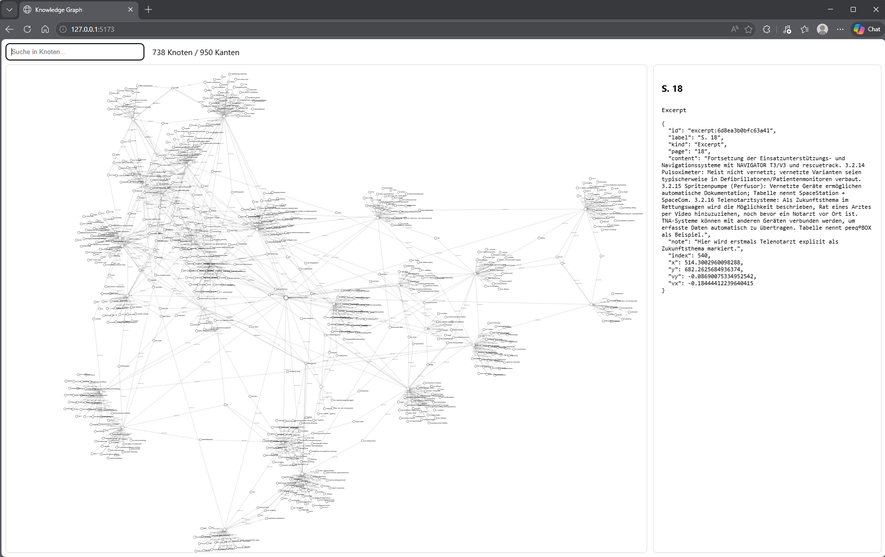
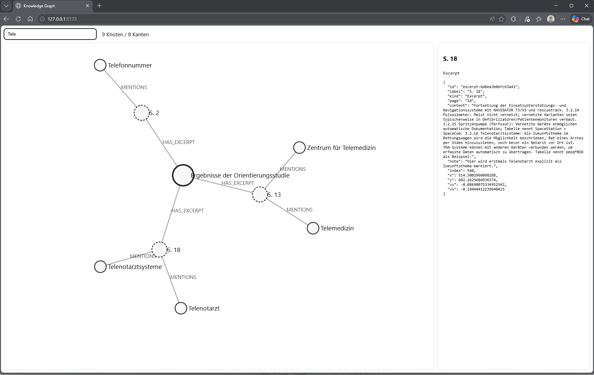

# Basic Knowledge Graph

Dieses Repository enthaelt mehrere Versionen des Wissensgraphen. Jede Version liegt in einem eigenen Ordner und bringt ihren eigenen Python-Extractor, eine Svelte/D3-Weboberflaeche, Beispieldaten, Bilder und einen Windows-Quickstart mit.

## Versionen

### withoutBoxing

`withoutBoxing` ist die reduzierte Grundversion. Sie erzeugt aus Markdown- oder PDF-Exzerpten einen nachvollziehbaren Wissensgraphen mit Dokument-, Exzerpt-, Entitaets- und Relationsknoten. Diese Version eignet sich, wenn vor allem die extrahierten Aussagen und ihre Belegstellen im Browser erkundet werden sollen.


Start:

```bat
cd withoutBoxing
quickstart.bat
```

### withBoxing

`withBoxing` erweitert die Grundversion um eine sichtbare TBox-Schicht. Gruene Boxen markieren Klassen, Unterklassen und Synonyme, zum Beispiel rund um Rettungsdienstfahrzeuge nach DIN EN 1789. Die aus Exzerpten gewonnenen Aussagen bleiben als ABox erhalten und werden ueber Klassifizierungsbeziehungen mit der TBox verbunden.





Start:

```bat
cd withBoxing
quickstart.bat
```

## Quickstart im Browser

Voraussetzungen:

- Windows
- Python 3.10 oder neuer
- Node.js mit npm

Der Quickstart wird aus dem Ordner der gewuenschten Version gestartet. Er erstellt bei Bedarf eine virtuelle Python-Umgebung, installiert die Python-Abhaengigkeiten, baut `graph.json`, kopiert sie nach `svelte-app/public/graph.json`, installiert die Node-Abhaengigkeiten und startet danach die Svelte-App mit Vite.

Nach dem Start oeffnet sich der Browser automatisch. Falls nicht, zeigt Vite im Terminal die lokale Adresse an, normalerweise:

```text
http://127.0.0.1:5173/
```

Der Wissensgraph laeuft dann als lokale Webanwendung im Browser. Der Vite-Server bleibt im Terminal aktiv; zum Beenden `Strg+C` druecken.

## Eigene Exzerpte

Beim Start fragt `quickstart.bat`, ob das Standardbeispiel oder eigene Exzerpte verwendet werden sollen. Bei eigenen Exzerpten oeffnet sich ein Dateidialog. Dort koennen eine oder mehrere Markdown- oder PDF-Dateien ausgewaehlt werden. Danach fragt das Skript, ob weitere Dateien hinzugefuegt werden sollen. Erst wenn diese Frage nicht mit `j` beantwortet wird, baut das Skript den Graphen und startet die Browseransicht.

Markdown-Exzerpte sollten diese Tabellenstruktur verwenden:

```markdown
| Seite | Inhalt | Anmerkung |
|-------|--------|-----------|
| 12 | Die Quelle beschreibt die Neuordnung lokaler Herrschaft. | Begriff "Herrschaft" pruefen. |
| 13 | Der Stadtrat ist Teil der lokalen Verwaltung. | Beleg fuer institutionelle Beziehung. |
```

Optional koennen vor der Tabelle Metadaten stehen:

```markdown
- **Haupttitel:** Beispielquelle
- **Autor:** Muster, Maria
- **Jahr:** 1848
```

## Bedienung

- Suche: filtert Knoten und Kanten ueber das Suchfeld.
- Mausrad: zoomt in den Graphen hinein oder heraus.
- Linke Maustaste auf freier Flaeche ziehen: rotiert die Ansicht.
- Rechte Maustaste auf freier Flaeche ziehen: verschiebt die Ansicht.
- Knoten anklicken: oeffnet rechts die Detailansicht mit Typ und Rohdaten.

Weitere Details stehen in den READMEs der einzelnen Versionen:

- [withoutBoxing/README.md](withoutBoxing/README.md)
- [withBoxing/README.md](withBoxing/README.md)
