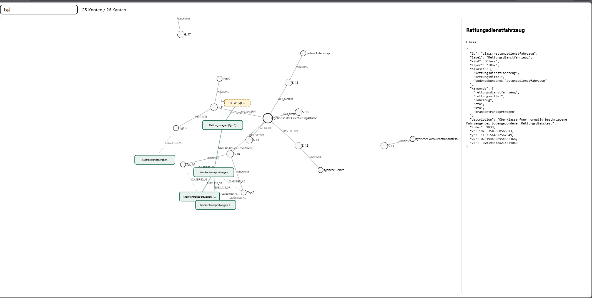

# Basic Knowledge Graph withBoxing

`withBoxing` erzeugt einen Wissensgraphen aus Exzerpten und ergaenzt ihn um eine sichtbare Box-Schicht. Diese Boxen sind keine zusaetzlichen Quellen, sondern eine begriffliche Ordnung, an die die aus dem Exzerpt gewonnenen Begriffe angeschlossen werden.

Die Variante ist besonders dann sinnvoll, wenn der Graph nicht nur zeigen soll, was in einem Text steht, sondern auch, in welche fachlichen Kategorien die Aussagen fallen. Das ist fuer RAG-Anwendungen interessant: Ein Retrieval-System kann Textstellen zu einem Begriff finden und zugleich erkennen, ob es gerade um Fahrzeuge, Normen, Schnittstellen, IT-Sicherheit, Schwachstellen, Daten oder konkrete vernetzte Systeme geht.




## Inhaltsverzeichnis

- [Was Boxing bedeutet](#was-boxing-bedeutet)
- [ABox, TBox und RAG](#abox-tbox-und-rag)
- [Beispiel: BSI-Orientierungsstudie und DIN EN 1789](#beispiel-bsi-orientierungsstudie-und-din-en-1789)
- [Schnellstart](#schnellstart)
- [Exzerpte eingeben](#exzerpte-eingeben)
- [Bedienung](#bedienung)
- [Technische Dokumentation](#technische-dokumentation)
- [Geschichtswissenschaftlicher Anspruch](#geschichtswissenschaftlicher-anspruch)
- [Manuelle Installation](#manuelle-installation)
- [Benutzte Literatur](#benutzte-literatur)

## Was Boxing bedeutet

Boxing heisst in dieser Projektversion: Der Graph bekommt zusaetzlich zu den aus dem Text extrahierten Knoten eine begriffliche Ordnung aus Klassen. Diese Klassen werden im Browser als gruenliche Boxen dargestellt. Sie bilden eine TBox, also eine terminologische Schicht.

Die normalen Textknoten bleiben erhalten. Eine eingelesene Datei wird ein `Document`, jede Tabellenzeile oder PDF-Seite wird ein `Excerpt`, erkannte Begriffe werden Entitaets- oder Konzeptknoten. Diese konkrete Ebene ist die ABox. Sie sagt: In diesem Exzerpt steht dieser konkrete Begriff, und diese Relation wurde aus diesem Satz abgeleitet.

Die Box-Schicht sagt dagegen: Dieser konkrete Begriff gehoert fachlich zu einer allgemeineren Klasse. Wenn im Exzerpt `BSI` erkannt wird, kann dieser Knoten mit der Klasse `Organisation` verbunden werden. Wenn `Bluetooth`, `WLAN` oder `NFC` erkannt werden, koennen diese Begriffe mit `Drahtlose Kommunikation` oder `Schnittstelle` verbunden werden. Wenn `DIN EN 1789` erkannt wird, kann der Begriff mit `Norm und Standard` und der konkreten Klasse `DIN EN 1789` verbunden werden.

Wichtig ist: Die Boxen ersetzen den Exzerpttext nicht. Sie legen nur eine zweite Leseschicht ueber den Graphen. Dadurch sieht man gleichzeitig die Belegstelle und die fachliche Einordnung.

## ABox, TBox und RAG

Die ABox enthaelt die konkreten Einzeldaten:

- `Document`: die eingelesene Datei.
- `Excerpt`: die konkrete Seite, Tabellenzeile oder PDF-Seite.
- `PER`, `ORG`, `LOC`, `MISC`, `Concept` oder `Entity`: erkannte Personen, Organisationen, Orte, Begriffe und Fallback-Entitaeten.
- Relationen wie `MENTIONS`, `IS_A`, `HAS_PART`, `USES`, `PART_OF` oder `EVIDENCE_FOR`.

Die TBox enthaelt die begriffliche Ordnung:

- Klassen wie `Rettungsdienst`, `Rettungsdienstfahrzeug`, `Medizinprodukt`, `Vernetztes System`, `Schnittstelle`, `Drahtlose Kommunikation`, `IT-Sicherheit`, `Schwachstelle`, `Angriff und Angriffsmodell`, `Kryptographie und Verschluesselung`, `Daten und Datenschutz`, `Firmware und Update`, `Norm und Standard`.
- Unterklassen wie `Krankentransportwagen`, `Krankentransportwagen Typ A1`, `Krankentransportwagen Typ A2`, `Notfallkrankenwagen` und `Rettungswagen (Typ C)`.
- Synonyme wie `RTW`, `KTW Typ C`, `BSI`, `FZI`, `TLS 1.3`, `BitLocker`, `Bluetooth`, `NFC` oder `Patientendaten`.

Fuer RAG ist diese Trennung hilfreich, weil Retrieval nicht nur wortgleich suchen muss. Ein RAG-System kann zum Beispiel Treffer zu `Bluetooth`, `BLE`, `WLAN` und `NFC` fachlich unter `Drahtlose Kommunikation` sammeln. Ebenso kann es Exzerpte zu `DIN EN 1789`, `Typ A1`, `Typ A2`, `Typ B` und `Typ C` als normbezogene Fahrzeugstellen erkennen. Die Antwortgenerierung kann dadurch gezielter erklaeren, ob ein Treffer eine konkrete Textstelle, eine allgemeine Klasse, ein Synonym oder eine Klassifizierungsbeziehung betrifft.

## Beispiel: BSI-Orientierungsstudie und DIN EN 1789

Das Beispiel `exzerpt2.md` beschreibt die BSI-Orientierungsstudie zum Projekt eMergent. Diese Studie kartiert vernetzte Produkte im bodengebundenen Rettungsdienst und erklaert unter anderem die Rolle der DIN EN 1789 fuer Rettungsdienstfahrzeuge.

In der Orientierungsstudie ist besonders wichtig, dass die DIN EN 1789 nicht einzelne Herstellerprodukte festlegt, sondern Fahrzeuggruppen und Ausstattungskategorien beschreibt. Der Graph bildet diese Unterscheidung als Box-Struktur ab:

- `DIN EN 1789` ist eine Klasse fuer den normativen Bezug.
- `Rettungsdienstfahrzeug` ist die Oberklasse fuer bodengebundene Fahrzeuge.
- `Krankentransportwagen` ist die Fahrzeuggruppe Typ A.
- `Krankentransportwagen Typ A1` und `Krankentransportwagen Typ A2` sind Unterklassen von `Krankentransportwagen`.
- `Notfallkrankenwagen` steht fuer Typ B.
- `Rettungswagen (Typ C)` steht fuer Typ C, also den Rettungswagen fuer erweiterte Behandlung und Ueberwachung.

Wenn im Exzerpt eine Seite zur Normendarstellung steht, etwa mit `DIN EN 1789`, `Typ A`, `Typ A1`, `Typ A2`, `Typ B`, `Typ C`, `KTW` oder `RTW`, dann erzeugt die Extraktion zunaechst konkrete ABox-Knoten aus genau diesem Eingabetext. Danach prueft `classify_entities_by_aliases()`, ob diese Knoten zu TBox-Klassen passen. Diese Pruefung nutzt die in der TBox hinterlegten `aliases`, `keywords` und teilweise `entity_kinds`.

Das bedeutet: Die sichtbaren Klassifizierungskanten haengen vom Exzerpt ab. Die TBox kennt zwar die moeglichen Boxen und Stichwoerter, aber verbunden wird nur das, was im Eingabetext als ABox-Knoten auftaucht. Wenn die BSI-Orientierungsstudie `DIN EN 1789` und `Typ C` nennt, entstehen passende Verbindungen zu `DIN EN 1789`, `Norm und Standard` und `Rettungswagen (Typ C)`. Wenn ein anderes Exzerpt stattdessen vor allem `Bluetooth`, `NFC`, `Patientendaten` und `Kiosk-Modus` nennt, verschiebt sich der sichtbare Schwerpunkt zu `Drahtlose Kommunikation`, `Daten und Datenschutz`, `Schnittstelle`, `Schwachstelle` oder `IT-Sicherheit`.

Anhand der DIN-Fahrzeugtypen sieht man auch, warum die Box-Schicht nicht nur Dekoration ist. Umgangssprachlich werden KTW- und RTW-Bezeichnungen manchmal vermischt. Im Code ist deshalb `KTW Typ C` als Synonym fuer `Rettungswagen (Typ C)` hinterlegt, gleichzeitig markiert eine TBox-Kante `RELATED_BUT_DISTINCT_FROM`, dass `Rettungswagen (Typ C)` fachlich mit `Krankentransportwagen` verwandt, aber normativ nicht dasselbe ist. Der Graph kann dadurch falsche Gleichsetzungen sichtbar machen, ohne die konkrete Formulierung im Exzerpt zu loeschen.

## Schnellstart

Unter Windows reicht in der Regel:

```bat
quickstart.bat
```

Das Skript richtet alles ein:

1. erstellt bei Bedarf eine Python-Umgebung unter `.venv`
2. installiert die Python-Abhaengigkeiten
3. installiert optional das deutsche spaCy-Modell
4. baut `graph.json`
5. kopiert die Graphdaten nach `svelte-app/public/graph.json`
6. installiert die Node-Abhaengigkeiten und startet den Vite-Server

Voraussetzungen sind Python 3.10+ und Node.js/npm. Nach dem Start zeigt Vite die lokale URL im Terminal an, typischerweise `http://localhost:5173/`.

## Exzerpte eingeben

Beim Start fragt `quickstart.bat`, ob das Standardbeispiel oder eigene Exzerpte verwendet werden sollen. Bei eigenen Exzerpten oeffnet sich ein Dateidialog. Dort koennen eine oder mehrere Markdown- oder PDF-Dateien ausgewaehlt werden. Danach fragt das Skript, ob weitere Exzerpte hinzugefuegt werden sollen. Erst wenn diese Frage nicht mit `j` beantwortet wird, baut das Skript den Wissensgraphen.

Markdown-Exzerpte sollten diese Tabellenstruktur verwenden:

```markdown
| Seite | Inhalt | Anmerkung |
|-------|--------|-----------|
| 10 | Fuer bodengebundene Rettungsdienstfahrzeuge gilt DIN EN 1789. Typ A beschreibt Krankentransportwagen. | Normstelle fuer KTW-Typen. |
| 11 | Typ C beschreibt Rettungswagen fuer erweiterte Behandlung und Ueberwachung. | Wichtig, weil Typ C nicht einfach KTW ist. |
```

Optional koennen vor der Tabelle Metadaten notiert werden:

```markdown
- **Haupttitel:** Ergebnisse der Orientierungsstudie
- **Herausgeber:** Bundesamt fuer Sicherheit in der Informationstechnik
- **Jahr:** 2023
```

Die CLI kann ebenfalls mehrere Dateien direkt verarbeiten:

```bash
python -m kgexzerpt.cli build exzerpt.md exzerpt2.md quelle.pdf --out graph.json --format svelte
```

## Bedienung

In der Visualisierung stehen diese Steuerungen zur Verfuegung:

- Suche: filtert Knoten und Kanten ueber das Suchfeld.
- Mausrad: zoomt in den Graphen hinein oder heraus.
- Linke Maustaste auf freier Flaeche ziehen: rotiert die Ansicht.
- Rechte Maustaste auf freier Flaeche ziehen: verschiebt die Ansicht.
- Knoten anklicken: oeffnet rechts die Detailansicht mit Typ und Rohdaten.

Die Darstellung unterscheidet drei Gruppen:

- ABox-Knoten werden als Kreise dargestellt.
- TBox-Klassen werden als gruene Boxen dargestellt.
- Synonyme werden als gelbe gestrichelte Boxen dargestellt.

Normale ABox-Kanten zeigen, was aus dem Text extrahiert wurde. TBox-Kanten zeigen die begriffliche Ordnung. Gestrichelte `CLASSIFIED_AS`-Kanten verbinden konkrete Textknoten mit passenden Boxen.

## Technische Dokumentation

### Pipeline von Exzerpt zu JSON

Der Einstiegspunkt ist die CLI in `kgexzerpt/cli.py`. Der Quickstart ruft intern diesen Befehl auf:

```bash
python -m kgexzerpt.cli build exzerpt.md exzerpt2.md --out graph.json --format svelte
```

Die CLI ruft `build_knowledge_graph()` aus `kgexzerpt/pipeline.py` auf. Die Verarbeitung laeuft in vier Schichten:

1. `load_sources()` liest Markdown- oder PDF-Dateien.
2. `KnowledgeGraph` baut aus Dokumenten, Exzerpten, Entitaeten und Relationen die ABox.
3. `add_domain_tbox()` aus `kgexzerpt/ontology.py` fuegt TBox-Klassen, Synonyme und Klassenrelationen hinzu.
4. `classify_entities_by_aliases()` verbindet ABox-Entitaeten ueber `CLASSIFIED_AS` mit passenden TBox-Klassen.

Intern wird ein `networkx.MultiDiGraph` verwendet. Beim Export erzeugt `to_svelte_json()` daraus eine JSON-Struktur mit `nodes` und `edges`; `export_json()` schreibt diese Struktur als UTF-8 nach `graph.json`.

### JSON-Struktur

Die Datei `graph.json` hat zwei Hauptfelder:

```json
{
  "nodes": [
    {
      "id": "class:it-sicherheit",
      "label": "IT-Sicherheit",
      "kind": "Class",
      "layer": "TBox"
    }
  ],
  "edges": [
    {
      "id": "CLASSIFIED_AS:...",
      "source": "entity:...",
      "target": "class:it-sicherheit",
      "type": "CLASSIFIED_AS",
      "layer": "ABox_to_TBox"
    }
  ]
}
```

Knoten enthalten mindestens `id`, `label` und `kind`. In `withBoxing` gibt es drei wichtige Gruppen:

- ABox-Knoten: `Document`, `Excerpt`, `Concept`, `PER`, `ORG`, `LOC`, `MISC` und weitere erkannte Entitaetstypen.
- TBox-Knoten: `Class`, also gruene Boxen wie `IT-Sicherheit`, `Rettungsdienst`, `Schnittstelle` oder `DIN EN 1789`.
- Synonym-Knoten: `Synonym`, also gelbe gestrichelte Boxen wie `RTW`, `Bluetooth`, `BitLocker` oder `BSI`.

Kanten enthalten mindestens `id`, `source`, `target` und `type`. Zusaetzlich tragen TBox-Kanten `layer: "TBox"`, Klassifizierungskanten `layer: "ABox_to_TBox"` und normale Extraktionskanten ABox-Eigenschaften wie `confidence` und `evidence`.

### ABox-Kantentypen

Diese Kanten entstehen aus den Eingabedaten und den extrahierten Textmustern:

- `HAS_EXCERPT`: verbindet Dokumente mit ihren Exzerpten.
- `MENTIONS`: verbindet ein Exzerpt mit jeder darin erkannten Entitaet.
- `EVIDENCE_FOR`: verbindet ein Exzerpt mit Subjekt und Objekt einer extrahierten Relation.
- `IS_A`: entsteht bei Mustern wie `ist`, `sind`, `gilt als`, `wird als`.
- `HAS_PART`: entsteht bei Mustern wie `enthaelt`, `umfasst`, `beinhaltet`, `besteht aus`.
- `USES`: entsteht bei Mustern wie `nutzt`, `verwendet`, `setzt ein`.
- `CAUSES_OR_ENABLES`: entsteht bei Mustern wie `fuehrt zu`, `ermoeglicht`, `bewirkt`, `schafft`.
- `DEPENDS_ON`: entsteht bei Mustern wie `haengt ab von`, `abhaengig von`.
- `PART_OF`: entsteht bei Mustern wie `ist Teil von`, `gehoert zu`.

Die Relationsextraktion sitzt in `PatternRelationExtractor`. Sie zerlegt den Exzerptinhalt in Saetze, prueft jeden Satz gegen definierte Regex-Muster und waehlt fuer Subjekt und Objekt die beste bereits erkannte Entitaet. Gibt es keinen direkten Treffer, wird aus den letzten Woertern des Satzteils ein `Concept` gebildet. Jede extrahierte Relation bekommt eine `confidence`, den Evidenzsatz und die `source_excerpt_id`.

### TBox-Kantentypen

Diese Kanten werden in `kgexzerpt/ontology.py` explizit aufgebaut:

- `SUBCLASS_OF`: ordnet Klassen hierarchisch ein, zum Beispiel `Schwachstelle -> IT-Sicherheit`, `Drahtlose Kommunikation -> Schnittstelle` oder `Rettungswagen (Typ C) -> Rettungsdienstfahrzeug`.
- `SYNONYM_OF`: verbindet Synonym-Knoten mit ihrer Klasse, zum Beispiel `RTW -> Rettungswagen (Typ C)` oder `BitLocker -> Kryptographie und Verschluesselung`.
- `DEFINED_BY`: verbindet normativ definierte Fahrzeugklassen mit `DIN EN 1789`.
- `RELATED_BUT_DISTINCT_FROM`: markiert fachlich verwandte, aber nicht identische Klassen; aktuell `Rettungswagen (Typ C) -> Krankentransportwagen`.
- `USED_IN`: verbindet Klassen mit ihrem Einsatzkontext, zum Beispiel `Medizinprodukt -> Rettungsdienst`.
- `PART_OF`: beschreibt Klassenbestandteile, zum Beispiel `Schnittstelle -> Vernetztes System` oder `Firmware und Update -> Vernetztes System`.
- `RELATED_TO`: beschreibt lose fachliche Naehe, zum Beispiel `Daseinsvorsorge und Gefahrenabwehr -> Rettungsdienst`.
- `SECURITY_MEASURE`: verbindet `Kryptographie und Verschluesselung` mit `IT-Sicherheit`.
- `PROTECTS_OR_ENDANGERS`: verbindet `Daten und Datenschutz` mit `IT-Sicherheit`.

Diese TBox-Kanten haben `layer: "TBox"` und werden in der Visualisierung gruener und staerker gezeichnet.

### CLASSIFIED_AS-Berechnung

`CLASSIFIED_AS` ist die Bruecke von ABox zu TBox. Sie wird nicht aus einem einzelnen Satzmuster gelesen, sondern nach dem Aufbau der TBox automatisch berechnet:

1. Alle `Class`-Knoten werden gesammelt.
2. Fuer jede Klasse werden `aliases`, `keywords` und optional `entity_kinds` normalisiert.
3. Alle ABox-Entitaeten werden durchlaufen; `Class`, `Synonym`, `Document` und `Excerpt` werden uebersprungen.
4. Pro Entitaet werden `label` und `aliases` normalisiert.
5. Eine `CLASSIFIED_AS`-Kante entsteht, wenn einer dieser Tests passt:
   - Der Entitaetstyp passt zu `entity_kinds`, zum Beispiel `ORG -> Organisation` oder `PER -> Person`.
   - Ein Alias stimmt exakt ueberein.
   - Ein Alias mit mindestens fuenf Zeichen ist im Entitaetslabel enthalten oder umgekehrt.
   - Ein Keyword mit mindestens vier Zeichen kommt im Entitaetslabel vor.
6. Die Kante bekommt `layer: "ABox_to_TBox"` und `matched_by`, zum Beispiel `entity_kind:ORG`, `alias` oder `keyword:bluetooth`.

Deshalb haengen die sichtbaren Box-Verbindungen vom Eingabe-Exzerpt ab. Die Ontologie gibt nur das Raster vor. Welche konkreten ABox-Knoten an dieses Raster angeschlossen werden, entscheidet sich durch die extrahierten Begriffe aus `Inhalt` und `Anmerkung`.

### Darstellung im Browser

Nach dem Bau kopiert `quickstart.bat` `graph.json` nach `svelte-app/public/graph.json`. Die Svelte-App laedt die Datei in `KnowledgeGraph.svelte` mit:

```js
graph = await fetch(url).then(r => r.json());
```

Danach rendert D3 eine Force-Layout-Simulation:

- `Class` wird als gruene Box gezeichnet.
- `Synonym` wird als gelbe gestrichelte Box gezeichnet.
- ABox-Knoten werden als Kreise gezeichnet.
- `layer: "TBox"` wird als gruene Kante gezeichnet.
- `layer: "ABox_to_TBox"` wird als gestrichelte Klassifizierungskante gezeichnet.
- Normale ABox-Kanten werden grau gezeichnet.
- Das Suchfeld filtert Knoten und zeigt nur Kanten, deren Quelle und Ziel sichtbar bleiben.
- Ein Klick auf einen Knoten zeigt rechts die Rohdaten aus dem JSON.

## Geschichtswissenschaftlicher Anspruch

Der Graph ist kein Ersatz fuer Quellenkritik, sondern ein Werkzeug zur strukturierten Exploration. Jede Wissenseinheit soll aus einem Exzerpt mit Seitenangabe, Inhalt und Anmerkung hervorgehen, damit Aussagen auf ihre Belegstelle zurueckgefuehrt werden koennen. Gerade fuer historische Arbeit ist wichtig, dass der Graph nicht vorgibt, Ambivalenz aufzuloesen: Er macht Verdichtungen, wiederkehrende Begriffe, Akteurskonstellationen und moegliche Relationen sichtbar, die anschliessend hermeneutisch und quellenkritisch geprueft werden muessen.

Die TBox macht diese Arbeit nicht automatisch wahrer oder vollstaendiger. Sie hilft nur, Begriffe systematisch zu gruppieren und wiederkehrende Kategorien sichtbar zu machen. Gerade deshalb bleibt die Detailansicht wichtig: Jede Klassifizierung sollte bei Bedarf am konkreten Exzerpt und am Rohdatenfeld `matched_by` geprueft werden.

## Manuelle Installation

Falls der Quickstart nicht genutzt werden soll:

```bash
python -m venv .venv
.\.venv\Scripts\activate
pip install -e .
python -m kgexzerpt.cli build exzerpt.md exzerpt2.md --out graph.json --format svelte
cd svelte-app
npm install
npm run dev
```

## Benutzte Literatur

- [Building Knowledge Graphs](https://go.neo4j.com/rs/710-RRC-335/images/Building-Knowledge-Graphs-Practitioner's-Guide-OReilly-book.pdf)
- [Knowledge Graphs data.world.pdf](https://page.data.world/hubfs/Knowledge%20Graphs%20data.world.pdf)
- [Knowledge Graphs](https://web.stanford.edu/class/cs520/How_To_Create_A_Knowledge_Graph_From_Data.pdf)
- [developers-guide-how-to-build-knowledge-graph.pdf](https://content.gitbook.com/content/sasnIfbOiAFHeOBcNUBB/blobs/MAe5jxOScBtqIFO1NjXV/developers-guide-how-to-build-knowledge-graph.pdf)
- [Construction of Knowledge Graphs: Current State and Challenges](https://dbs.uni-leipzig.de/files/research/publications/2024-8/pdf/information-15-00509-with-cover.pdf)
- [Knowledge Graph Chunking for RAG: TBox, ABox, and Advanced Strategies](https://medium.com/@visrow/knowledge-graph-chunking-for-rag-tbox-abox-and-advanced-strategies-b922ea286a6c)
